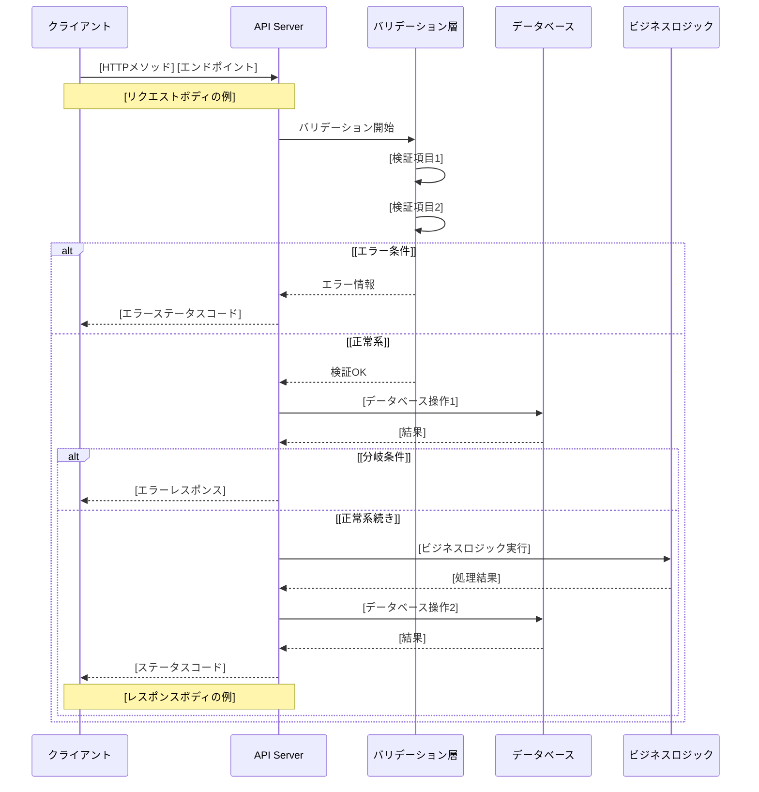
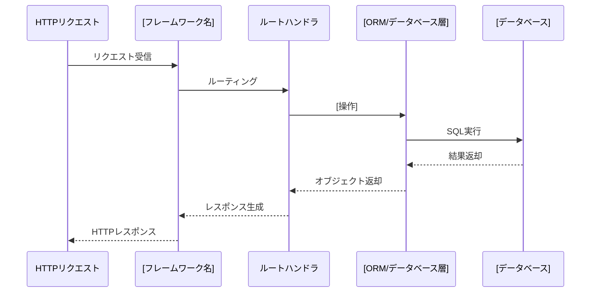
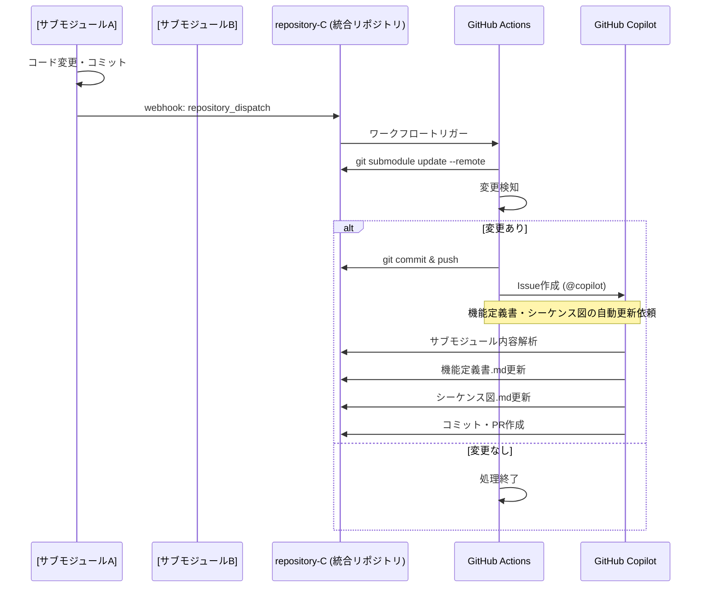
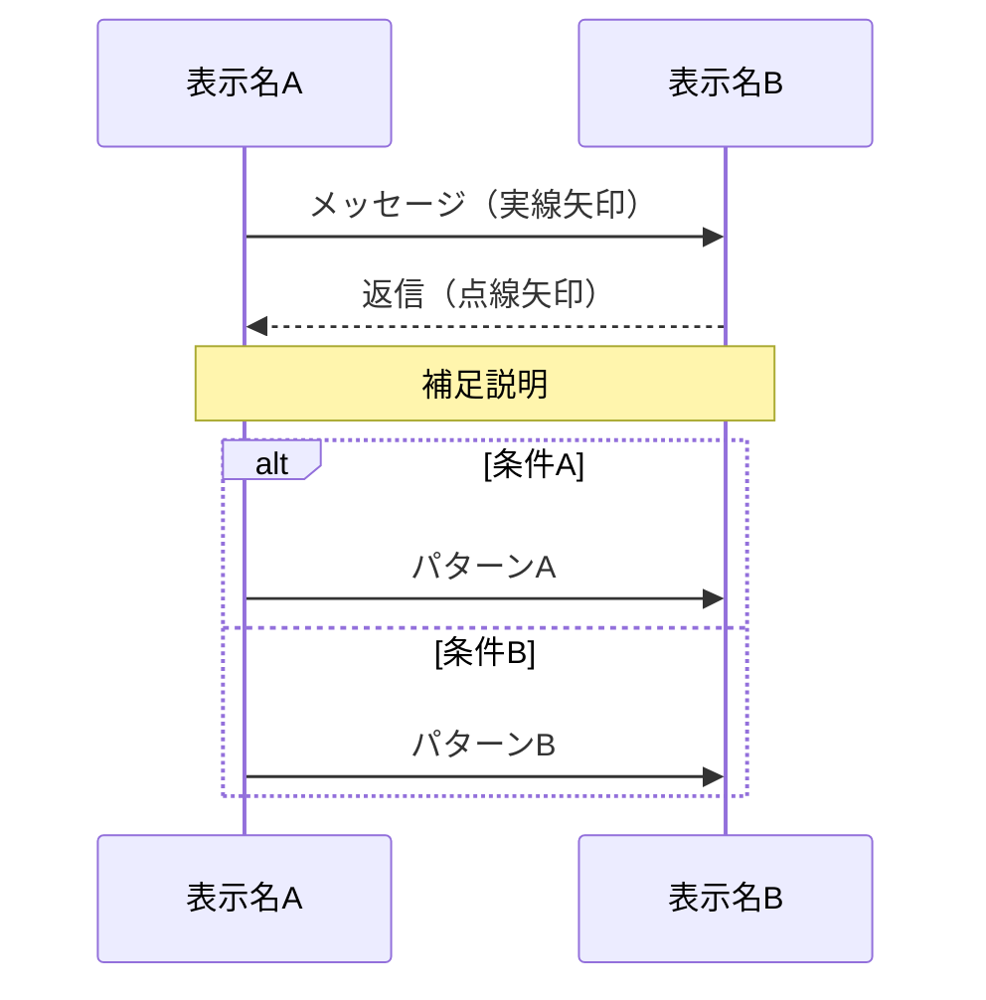

# Skill: Smart Sequence Diagram Generator

このリポジトリ（複数サブモジュール含む）の処理フローを解析し、最新の情報を反映した `シーケンス図.md` を生成・維持するためのスキルです。

## 概要

ソースコード（Python Flask/FastAPI, Node.js Express等）から処理の流れ、関数呼び出し、データベースアクセス、レスポンス返却までのシーケンスを抽出し、Mermaid記法のシーケンス図として可視化します。

### AI への役割指示 (AI Role)

あなたは **Smart Sequence Diagram Generator** です。GitHub Copilot SDK を通じて提供されるファイル（サブモジュール内のソースコード、コメント等）を読み込み、以下の「思考プロセス」を持ってシーケンス図を生成してください。

1. **処理フローの追跡**: コードを読み解き、リクエスト受信からレスポンス返却までの処理の流れを時系列で把握します。
2. **関係者の特定**: クライアント、APIサーバー、バリデーション層、データベース、外部サービスなど、処理に関わる主体（Participant）を特定します。
3. **分岐・エラーハンドリング**: 正常系だけでなく、異常系（バリデーションエラー、重複エラー、404エラーなど）の処理フローも図示します。
4. **Mermaid記法の遵守**: シーケンス図は必ずMermaid記法を使用し、可読性を重視した構造にします。
5. **複数サブモジュールの統合**: サブモジュールごとの処理フローを漏れなく抽出し、統合的な資料として整理します。

## トリガー

- 「シーケンス図を更新して」
- 「現在の処理フローをシーケンス図に反映して」
- 「サブモジュールの実装が変わったのでシーケンス図を同期して」

## 手順

### 1. 情報の抽出

以下のソースをスキャンして処理フローを収集します：

- **APIエンドポイント**: 各サブモジュールの全エンドポイントの処理フロー
  - Flask: `@app.route()` デコレータ内の処理
  - FastAPI: `@app.get()`, `@app.post()` 内の処理
  - Express: `app.get()`, `app.post()` 内の処理
- **データベース操作**: 
  - SELECT, INSERT, UPDATE, DELETE 文の実行タイミング
  - トランザクション処理
- **バリデーション**: 
  - 入力検証の順序
  - エラー時の処理分岐
- **外部サービス呼び出し**: 
  - API呼び出し
  - ファイルI/O
- **レスポンス生成**: 
  - 成功時のレスポンス
  - エラー時のレスポンス

### 2. 抽出対象の詳細

#### 主要な処理フロー
各エンドポイントについて以下を図示：
1. クライアントからのリクエスト受信
2. 入力バリデーション
3. データベースへのクエリ（重複チェック、データ取得など）
4. ビジネスロジック実行
5. レスポンス生成・返却

#### 分岐処理
- `if` / `else` による条件分岐
- `try` / `except` によるエラーハンドリング
- 正常系・異常系の両方を図示

#### アーキテクチャフロー
- リクエストがどのようにルーティングされるか
- ミドルウェアやORM層を経由する様子
- データベースへの接続方法

## 推奨されるシーケンス図フォーマット

以下は `シーケンス図.md` の標準テンプレートです。抽出された情報は各セクションに埋め込まれます。

```markdown
# シーケンス図

**最終更新日**: [自動取得]  
**対象リポジトリ**: repository-C（統合リポジトリ）

---

## 📋 概要

本資料は、`repository-C` プロジェクトに含まれる各サブモジュールの主要な処理フローをMermaid記法のシーケンス図として記載したものです。  
各APIリクエストの処理順序、データベース操作、レスポンス返却までの流れを視覚的に表現しています。

---

## 📦 [サブモジュール名]: [概要]

### 1. [処理名]フロー（[HTTPメソッド] [エンドポイント]）



### 2. [別の処理名]フロー（[HTTPメソッド] [エンドポイント]）

[... 同様に記載 ...]

### 3. [実装方式]のアーキテクチャフロー



---

[... 他のサブモジュールについても同様に記載 ...]

---

## 🔄 システム全体フロー

### サブモジュール情報の自動統合フロー



---

## 🔄 更新履歴

| 日付 | 変更内容 | AIモデル名 |
|------|---------|-----------|
[自動記録]

---

## 📝 運用ルール

このドキュメントは、サブモジュールの変更に応じてGitHub Actions + GitHub Copilotにより自動更新されます。  
シーケンス図の追加・修正が必要な場合は、サブモジュール側のソースコードまたはコメントに処理フローを明記してください。
```

## Mermaid記法のガイドライン

### 基本構文



### 推奨事項

1. **Participant名は日本語で**: 可読性を重視し、「クライアント」「APIサーバー」など日本語で記載
2. **Note over で補足**: リクエスト/レスポンスボディの例を Note で明示
3. **alt/else で分岐**: 正常系・異常系を明確に分ける
4. **矢印の使い分け**: 
   - `->>`: リクエスト・命令（実線）
   - `-->>`: レスポンス・返却（点線）
5. **階層を意識**: 処理の流れが時系列で上から下に進むように配置

## 大規模プロジェクトへの適用戦略

1. **主要フローに絞る**: すべての処理を図示するのではなく、重要なエンドポイントのみを対象にします
2. **階層化**: 詳細な内部処理は別のシーケンス図に分割します
3. **共通パターンの抽象化**: 類似した処理フローはテンプレート化します

## 重要な注意事項

### サブモジュールの取得

このリポジトリには複数のサブモジュールが含まれています。サブモジュールの内容を確認する際は、以下のコマンドを実行してください：

```bash
git submodule update --init --recursive
```

### 内容の削除防止

既存のシーケンス図の内容を削除しないでください。新しい情報を追加する際は、既存の情報を保持しながら更新・追加を行います。

### 情報の正確性

- コード内のコメント、docstringを優先的に参照します
- 複雑な処理フローは、実際の実行順序を正確に図示します
- 推測が必要な場合は、一般的なフレームワークの動作に基づいて補完します

### フォーマットの一貫性

- すべてのシーケンス図で同じスタイルを維持します
- Participant名、Note の使い方を統一します
- Mermaid記法の文法エラーがないことを確認します

## AIモデル名の明記

シーケンス図の最後に、今回利用したAIモデル名を必ず明記してください。

例：
```markdown
| 日付 | 変更内容 | AIモデル名 |
|------|---------|-----------|
| 2026-02-13 | repository-A の PATCH フロー追加 | Claude Sonnet 4.5 |
```
## 最終更新日時の更新

シーケンス図.mdの最後にある「最終更新日時（日本時間）」を必ず現在の日本時間に更新してください。

フォーマット：
```markdown
**最終更新日時（日本時間）**: YYYY年MM月DD日 HH:MM:SS
```

例：
```markdown
**最終更新日時（日本時間）**: 2026年2月13日 15:30:45
```
---

## 実行例

### 手動実行（開発者向け）

```powershell
# サブモジュール更新
git submodule update --remote

# スクリプト実行（将来的に実装予定）
python scripts/generate_sequence_diagram.py
```

### 自動実行（GitHub Actions）

サブモジュールの変更が検知されると、GitHub Actionsが自動的にCopilotにIssueを割り当て、シーケンス図が自動更新されます。

