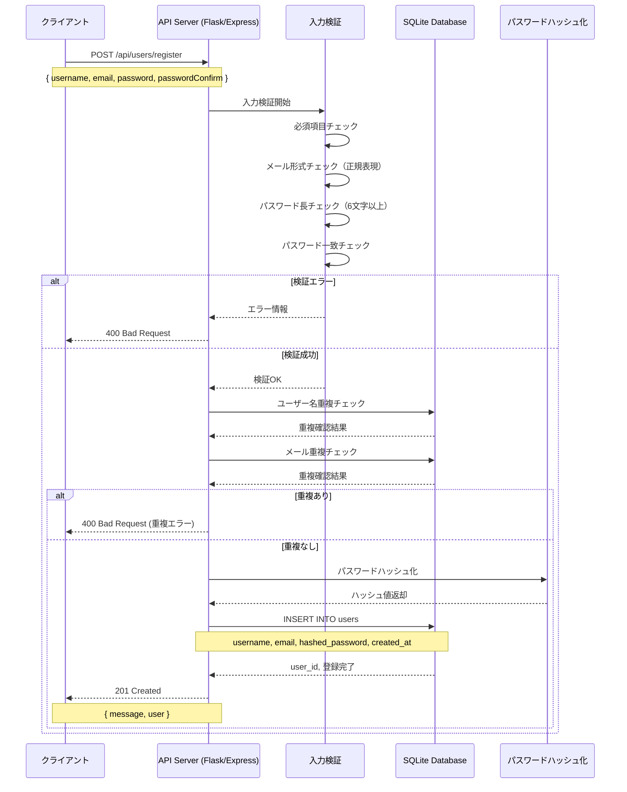
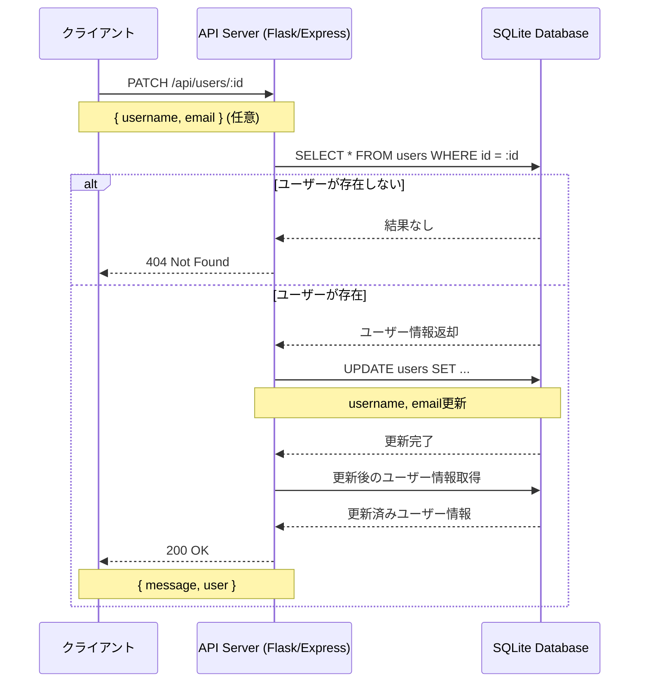
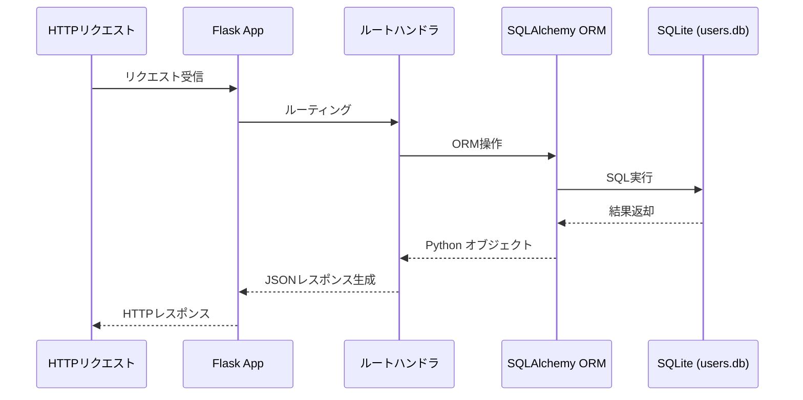
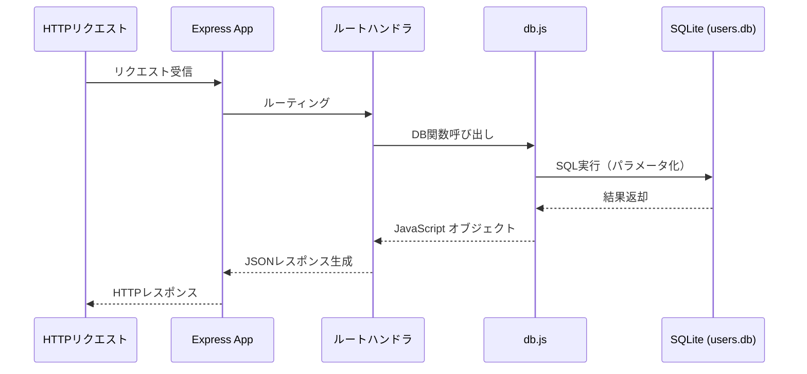
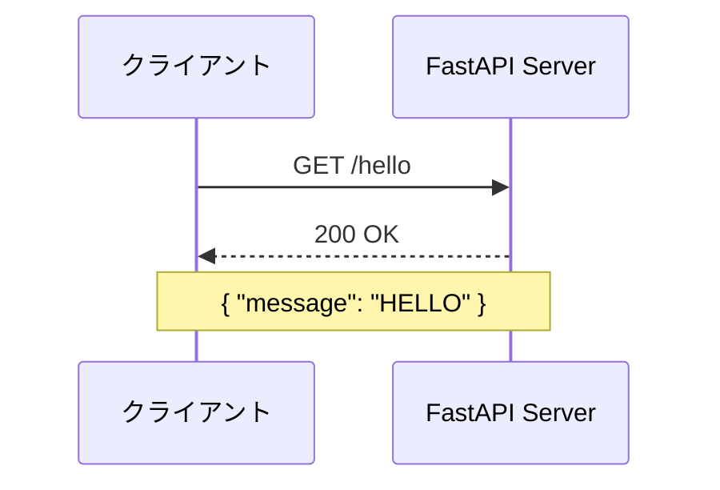
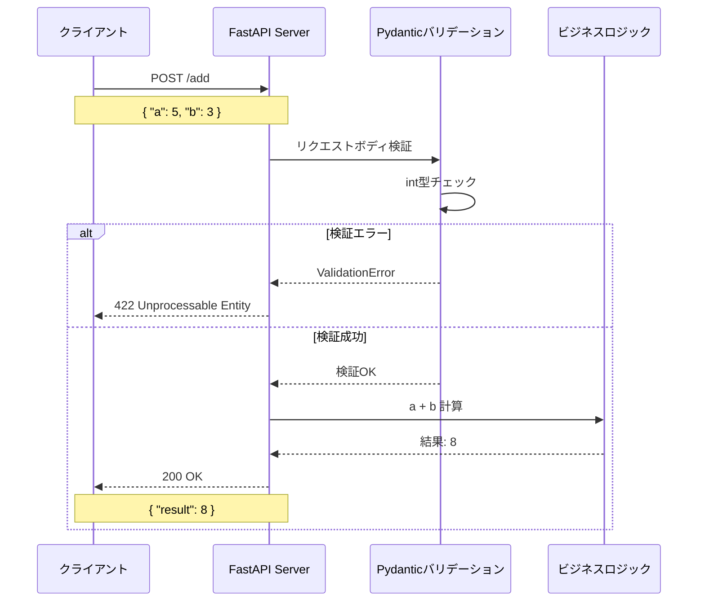
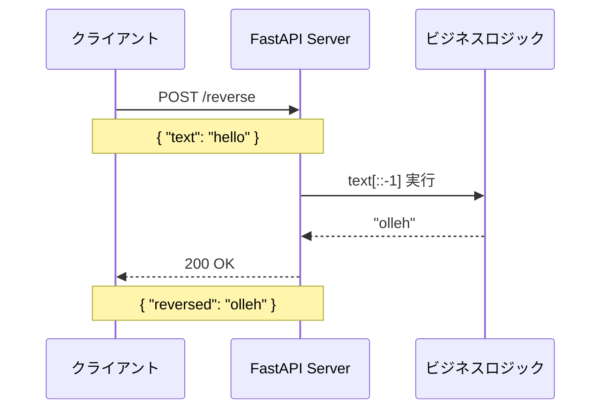
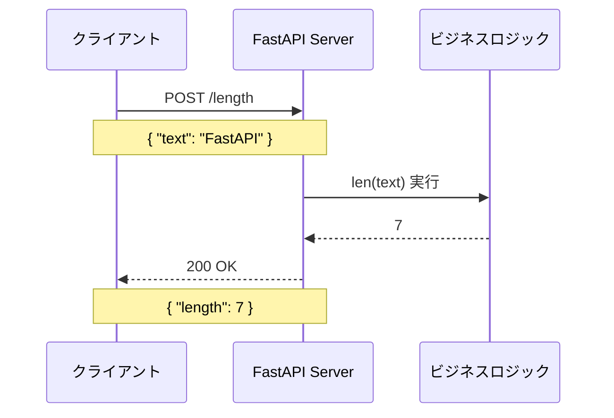
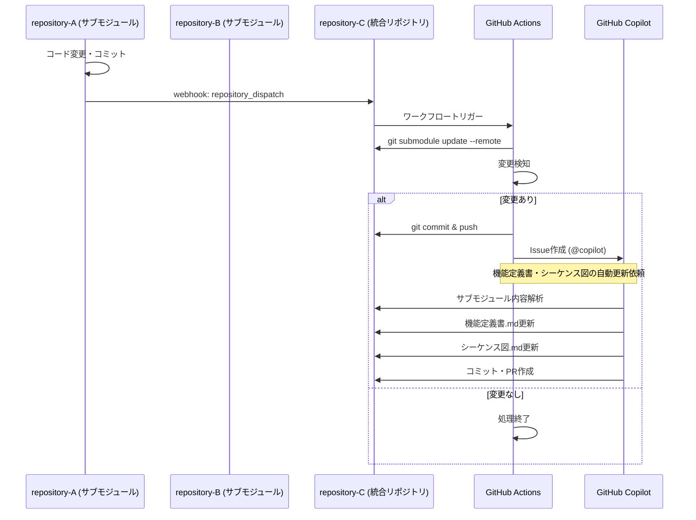

# シーケンス図

**最終更新日**: 2026年2月13日  
**対象リポジトリ**: repository-C（統合リポジトリ）

---

## 📋 概要

本資料は、`repository-C` プロジェクトに含まれる各サブモジュールの主要な処理フローをMermaid記法のシーケンス図として記載したものです。  
各APIリクエストの処理順序、データベース操作、レスポンス返却までの流れを視覚的に表現しています。

---

## 📦 repository-A: ユーザー登録API

### 1. ユーザー登録フロー（POST /api/users/register）

### 2. ユーザー情報更新フロー（PATCH /api/users/<user_id>）

### 3. Flask実装のアーキテクチャフロー

### 4. Node.js実装のアーキテクチャフロー

---

## 📦 repository-B: FastAPI サーバー

### 1. Hello World（GET /hello）

### 2. 数値加算（POST /add）

### 3. 文字列反転（POST /reverse）

### 4. 文字列長（POST /length）

---

## 🔄 システム全体フロー

### サブモジュール情報の自動統合フロー

---

## 🔄 更新履歴

| 日付 | 変更内容 | AIモデル名 |
|------|---------|-----------|
| 2026-02-13 | 初版作成 | Claude Sonnet 4.5 |

---

## 📝 運用ルール

このドキュメントは、サブモジュールの変更に応じてGitHub Actions + GitHub Copilotにより自動更新されます。  
シーケンス図の追加・修正が必要な場合は、サブモジュール側のソースコードまたはコメントに処理フローを明記してください。

---

**最終更新日時（日本時間）**: 2026年2月13日 00:00:00

